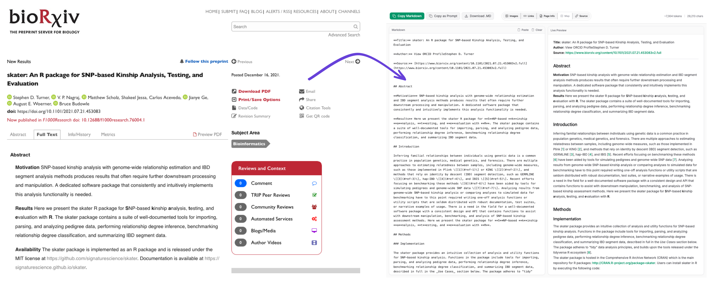

# markdownme

Turn any webpage into clean, LLM-ready Markdown in one click. Strip the browser, keep the structure, then copy or download instantly.



## How it works

1. Open any webpage
2. Click the markdownme toolbar button (or press `Alt+M`)
3. Get clean Markdown instantly

## Features

- **One-click conversion** via toolbar button or `Alt+M` keyboard shortcut (configurable in Settings)
- **Smart extraction** powered by Mozilla's Readability to isolate main content and ignore ads, navbars, and boilerplate
- **Dedicated preview tab** with a live split-pane editor and rendered preview
- **Toggles** to customize output: images, links, metadata (title/author/date), source URL, and a document structure map
- **Export options:** copy to clipboard, download as `.md`, or copy wrapped as a code block for AI prompts

## Why Markdown for LLMs

HTML pages carry navigation bars, scripts, ads, and deeply nested DOM structures that consume context window without adding meaning. Clean Markdown removes the noise, preserves headings and structure, and fits more useful content into limited context windows.

## Installation

The extension is available on [Firefox Add-ons](https://addons.mozilla.org/en-US/firefox/addon/markdownme/).

Or build it yourself from source (see below).

## Building from source

### Environment

- **OS:** macOS, Linux, or Windows (WSL recommended on Windows)
- **Node.js:** v18 or later — [nodejs.org](https://nodejs.org/)
- **pnpm:** v9 or later — install with `npm install -g pnpm`

Key build dependencies (installed automatically via `pnpm install`):
- Plasmo 0.90.3 (extension framework and bundler)
- TypeScript 5.3.3
- React 18.2.0

### Development

```bash
# Install dependencies
pnpm install

# Start the dev server (outputs to build/firefox-mv3-dev/)
pnpm dev
```

Then load it in Firefox:

1. Go to `about:debugging#/runtime/this-firefox`
2. Click **Load Temporary Add-on**
3. Navigate to `build/firefox-mv3-dev/` and select the `manifest.json` file

The extension will stay loaded until you close Firefox or click "Remove."

### Iterating

Plasmo watches your files and rebuilds on save. After each rebuild:

- Changes to `tabs/markdown.tsx` (the preview UI) — reload the open preview tab, or trigger the extension again on any page
- Changes to `content.ts` or `background.ts` — go to `about:debugging`, find the extension, and click **Reload**. Content scripts are injected at page load time, so a full reload is required for those changes to take effect

One gotcha: temporary add-ons are wiped when Firefox closes. You have to re-load from `about:debugging` each time you restart. That's expected — the permanent install only happens after you sign and install the built `.zip`.

### Production build

Before building, set the version number in `package.json`:

```json
"version": "1.0.0"
```

Firefox Add-ons requires versions to always increment — `1.0.0` → `1.0.1` → `1.1.0` etc. Plasmo reads this field and embeds it in the built manifest automatically.

```bash
pnpm build
```

This produces two things in `build/firefox-mv3-prod/`:

- A folder with the unpacked extension
- A `.zip` file ready for upload to Firefox Add-ons

### Local install (signed, permanent)

To install permanently without waiting for AMO review, sign for self-distribution using `web-ext`. Get API credentials from `addons.mozilla.org/developers/addon/api/key/`, then add them to `.env` (already gitignored):

```
WEB_EXT_API_KEY=your-jwt-issuer
WEB_EXT_API_SECRET=your-jwt-secret
```

Then build and sign:

```bash
pnpm build
source .env && web-ext sign --channel=unlisted \
  --source-dir=build/firefox-mv3-prod \
  --api-key=$WEB_EXT_API_KEY \
  --api-secret=$WEB_EXT_API_SECRET
```

The signed `.xpi` lands in `web-ext-artifacts/`. Open it in Firefox to install permanently. This doesn't conflict with a listed submission that's under review.

### Submitting to Firefox Add-ons (AMO)

1. Run `pnpm build` to generate the zip
2. Sign in at [addons.mozilla.org/developers](https://addons.mozilla.org/en-US/developers/)
3. Click **Submit a New Add-on** (or **Upload New Version** for updates)
4. Upload the `.zip` from `build/firefox-mv3-prod/`
5. When prompted for source code, AMO will ask whether you use any build tools. Answer yes — Plasmo uses esbuild to bundle and minify the source files. Generate the source zip with:

   ```bash
   zip -r markdownme-source.zip . --exclude "node_modules/*" --exclude "build/*" --exclude ".git/*"
   ```

   Upload that zip. AMO reviewers will run `pnpm install` and `pnpm build` to verify the output matches the submitted extension.
6. Fill in the listing details and submit for review

> **Note:** Before submitting, update the `gecko.id` in `package.json` under `manifest.browser_specific_settings.gecko` to a unique identifier for your listing (e.g., `"your-addon-name@yourdomain"`). This ID must match across all versions you submit.

## Built with

- [Plasmo](https://plasmo.com/) — browser extension framework
- [React](https://reactjs.org/) — UI
- [Tailwind CSS](https://tailwindcss.com/) — styling
- [@mozilla/readability](https://github.com/mozilla/readability) — content extraction
- [Turndown](https://github.com/mixmark-io/turndown) — HTML to Markdown

## License

MIT

## Credits

Originally created by [Adem Kouki](https://github.com/Ademking).
